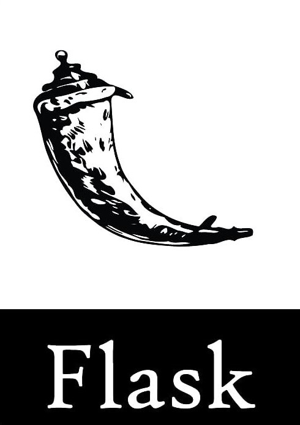

<!-- PROJECT LOGO -->
<br />
<p align="center">
  <a href="https://github.com/whoismaruf/flask2do">
    
  </a>

  <h2 align="center">flask2do</h2>

  <p align="center">
    A Simple & Secured ToDo Web Application
    <br />
    <a href="https://github.com/whoismaruf/flask2do"><strong>Explore the docs »</strong></a>
    <br />
    <br />
    <a href="https://github.com/whoismaruf/flask2do">View Demo</a>
    ·
    <a href="https://github.com/whoismaruf/flask2do/issues">Report Bug</a>
    ·
    <a href="https://github.com/whoismaruf/flask2do/issues">Request Feature</a>
  </p>
</p>


<!-- TABLE OF CONTENTS -->
## Table of Contents

* [About the Project](#about-the-project)
  * [Built With](#built-with)
* [Getting Started](#getting-started)
  * [Prerequisites](#prerequisites)
  * [Installation](#installation)
* [Usage](#usage)
* [Roadmap](#roadmap)
* [Contributing](#contributing)
* [License](#license)
* [Contact](#contact)
* [Acknowledgements](#acknowledgements)


<!-- ABOUT THE PROJECT -->
## About The Project

Hi there 🖐
This is a simple ToDo web application built on top of __Flask__ web framework with `User Authentication` Functionality. You can create and modify your __Task__ easily by this application. More `improvements` and `features` will be added trhough updates.
Let's see some of the screenshots - 
<br>

[![Product Name Screen Shot][product-screenshot]](https://example.com)


### Built With

* [Python]()
* [Flask]()
* [HTML, CSS & JS]()


<!-- GETTING STARTED -->
## Getting Started

To get a local copy up and running follow these simple steps.

This is an example of how to list things you need to use the software and how to install them.

<br>

* Clone the repo

```sh
git clone https://github.com/whoismaruf/flask2do.git
```
<br>

* Setup Environment

```sh
python -m venv your_preffered_env_name
```
```sh 
source your_preffered_env_name/scripts/activate
```
_Use this coomand_ ```source your_preffered_env_name/bin/activate``` _in Linux_
<br>
* Install Packages
```sh
pip install -r requirements.txt
```


* Run
```sh
python run.py
```


<!-- USAGE EXAMPLES -->
## Usage Policy

Please mention me while you use this application on production or any kinda personal usages. Don't sell or duplicate this project for Business purposes. Happy coding !!


<!-- ROADMAP -->
## Roadmap

See the [open issues](https://github.com/whoismaruf/flask2do/issues) for a list of proposed features (and known issues).


<!-- CONTRIBUTING -->
## Contributing

Contributions are what make the open source community such an amazing place to be learn, inspire, and create. Any contributions you make are **greatly appreciated**.

1. Fork the Project
2. Create your Feature Branch (`git checkout -b feature/AmazingFeature`)
3. Commit your Changes (`git commit -m 'Add some AmazingFeature'`)
4. Push to the Branch (`git push origin feature/AmazingFeature`)
5. Open a Pull Request


<!-- LICENSE -->
## License

Distributed under the MIT License. See `LICENSE` for more information.


<!-- CONTACT -->
## Contact
[✅ Twitter](https://twitter.com/whoismaruf) 
[✅ LinkedIn](https://linkedin.com/in/whoismaruf)
[✅ Facebook](https://facebook.com/whoizmaruf)


<!-- ACKNOWLEDGEMENTS -->
## Acknowledgements

* [Maruf Khan](https://github.com/whoismaruf)


<!-- MARKDOWN LINKS & IMAGES -->
<!-- https://www.markdownguide.org/basic-syntax/#reference-style-links -->
[contributors-shield]: https://img.shields.io/github/contributors/whoismaruf/repo.svg?style=flat-square
[contributors-url]: https://github.com/whoismaruf/flask2do/graphs/contributors
[forks-shield]: https://img.shields.io/github/forks/whoismaruf/repo.svg?style=flat-square
[forks-url]: https://github.com/whoismaruf/repo/network/members
[stars-shield]: https://img.shields.io/github/stars/whoismaruf/repo.svg?style=flat-square
[stars-url]: https://github.com/whoismaruf/repo/stargazers
[issues-shield]: https://img.shields.io/github/issues/whoismaruf/repo.svg?style=flat-square
[issues-url]: https://github.com/whoismaruf/repo/issues
[license-shield]: https://img.shields.io/github/license/whoismaruf/repo.svg?style=flat-square
[license-url]: https://github.com/whoismaruf/repo/blob/master/LICENSE.txt
[linkedin-shield]: https://img.shields.io/badge/-LinkedIn-black.svg?style=flat-square&logo=linkedin&colorB=555
[linkedin-url]: https://linkedin.com/in/whoismaruf
[product-screenshot]: docs/images/scr01.png
